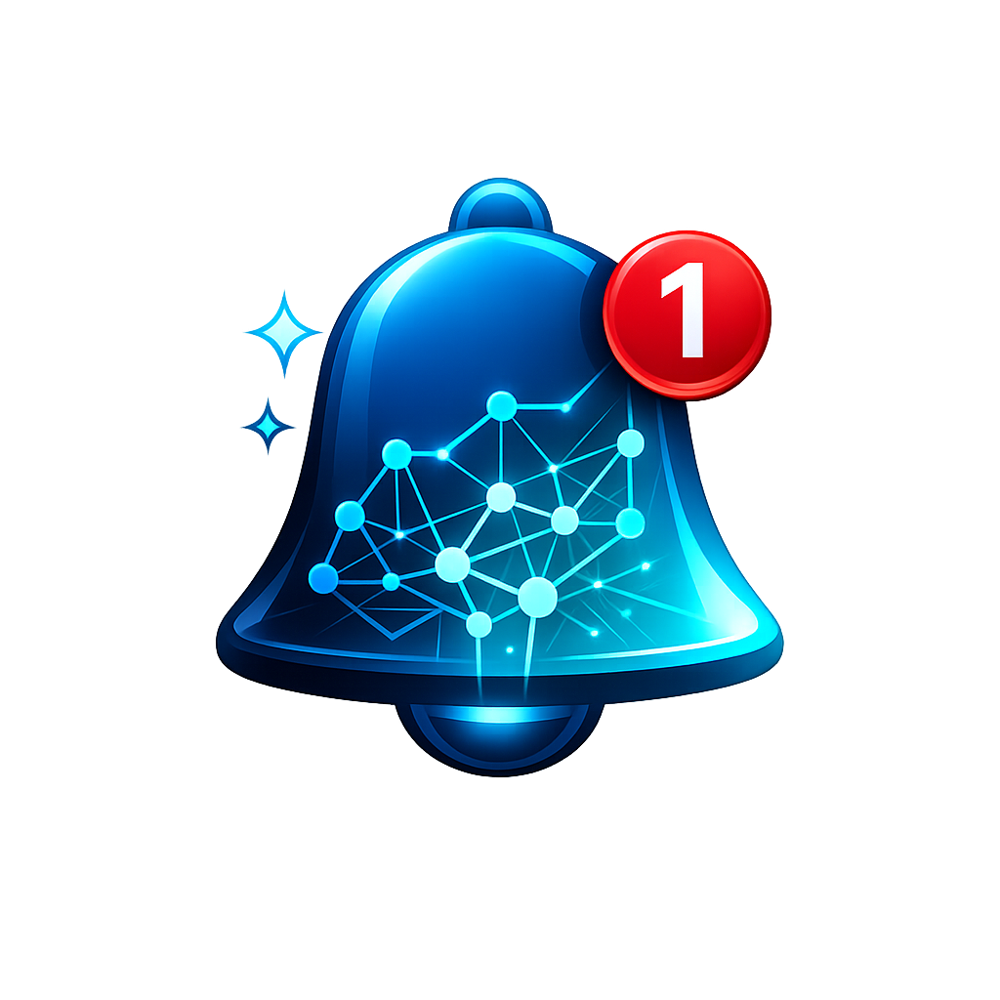

# Agent Alert

<p align="center">
  
</p>

A macOS menu bar application that displays intelligent notifications from Claude Code without interrupting your workflow.

## Features

- **Claude Code Integration**: Receives notifications from Claude Code hooks (stop, notification, permission request, session end, etc.)
- **Menu Bar Interface**: Accessible through system menu bar with minimal UI footprint
- **Customizable Settings**: Configure notification sounds and display preferences
- **Notification History**: View and manage recent notifications
- **Non-intrusive Design**: Runs as a menu bar utility (LSUIElement = true)

## Installation

Download the latest release from the [Releases page](https://github.com/hiraism/agent-alert/releases) and install the DMG.

## Usage

### HTTP API

Agent Alert exposes a local HTTP server on port 7531 for receiving notifications from Claude Code:

```bash
# POST notification
curl -X POST http://127.0.0.1:7531/notify \
  -H "Content-Type: application/json" \
  -d '{"hook_event_name": "Stop", "last_assistant_message": "Task completed"}'

# Health check
curl http://127.0.0.1:7531/health
```

### Claude Code Hook Configuration

Add the following to your Claude Code settings to send notifications to Agent Alert:

```json
{
  "hooks": {
    "Stop": "http://127.0.0.1:7531/notify",
    "Notification": "http://127.0.0.1:7531/notify",
    "PermissionRequest": "http://127.0.0.1:7531/notify"
  }
}
```

## Configuration

The application supports several configurable options available in the Settings panel:

- Enable/disable notification sounds
- Select from system notification sounds
- View notification history
- Clear all notifications

## System Requirements

- macOS 15.0+
- Xcode 15.0+
- Swift 5.9+

## License

This project is licensed under the MIT License.
